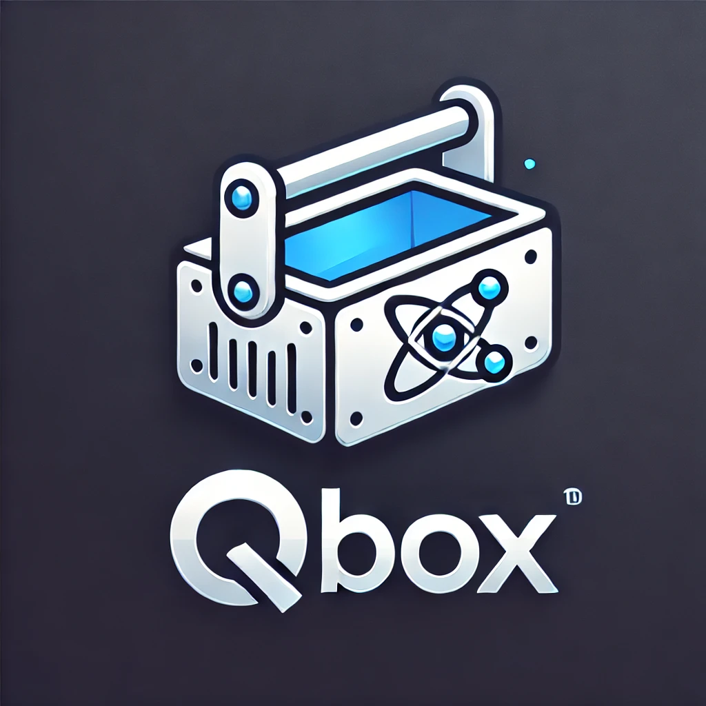

# QBox - The Quarkus CLI Toolbox
<div style="text-align: center;">
    
</div>

QBox is your Swiss Army knife for command-line operations, built on the supersonic Quarkus framework. From data formatting to database management and encryption, QBox is designed to enhance your workflow with minimal effort.

---

## 🌟 Features

- **Formatter**: Convert data seamlessly between formats like JSON, YAML, XML, CSV, and plain text.
- **Encryption**: Secure your sensitive data with built-in encryption and decryption capabilities.
- **SQLite Management**: Easily create, query, and manage SQLite databases from the CLI.
- **Logger**: A highly configurable logging utility for CLI and script-friendly output.
- **Completion**: Generate shell completions for an improved command-line experience.

---

## 📜 Usage

### General Syntax
```bash
qbox <command> [options]
```

### Available Commands
- **`completion`**: Generate shell auto-completion scripts.
- **`formatter`**: Convert data formats with ease.
- **`encryption`**: Encrypt or decrypt files or strings.
- **`sqlite`**: Manage SQLite databases and execute queries.
- **`logger`**: Log messages to the console or a file with custom levels and formats.

---

## 🛠️ Examples

### Data Formatting

**Convert JSON to YAML:**
```bash
qbox formatter format \
    --input='{"name":"Alice","age":30}' \
    --output=output.yaml \
    --input-format=JSON \
    --output-format=YAML
```

**Convert YAML to JSON:**
```bash
qbox formatter format \
    --input='name: Alice\nage: 30' \
    --output=output.json \
    --input-format=YAML \
    --output-format=JSON
```

---

### SQLite Management

**Create a Database:**
```bash
qbox sqlite create-db \
    examples/key_value_schema.sql \
    --output-db=examples/test.db
```

**Query the Database:**
```bash
qbox sqlite query \
    --db=examples/test.db \
    --query="SELECT * FROM key_value_store;"
```

---

### Logging

**Log an INFO message to the console:**
```bash
qbox logger -m "Application started" -l INFO
```

**Log a message in JSON format to a file:**
```bash
qbox logger -m "Task completed" -l INFO --format=json --output=task.log
```

---

### Encryption

**Encrypt a file:**
```bash
qbox encryption encrypt \
    --input=examples/test.txt \
    --output=examples/encrypted.txt \
    --password=myStrongPassword
```

**Decrypt the file:**
```bash
qbox encryption decrypt \
    --input=examples/encrypted.txt \
    --output=examples/decrypted.txt \
    --password=myStrongPassword
```

---

### Command Auto-Completion

Enable shell auto-completion for faster command writing:
```bash
qbox completion
source qbox_completion
```

---

## 📦 Installing QBox System-Wide

After building the native binary, you can move it to a directory in your system's `PATH` for easier use:
```bash
sudo mv qbox /usr/local/bin/
```

You can now use `qbox` from anywhere in your terminal.

---

## 🧪 Testing

Run the full suite of unit tests to ensure everything works as expected:
```bash
mvn test
```

---

## 📦 Building QBox

Build the native binary:
```bash
quarkus build -Dnative --clean
```

Run the binary:
```bash
./qbox <command> [options]
```

---

## 🌍 Contributing

We welcome contributions to QBox! To get started:
1. Fork this repository.
2. Create a feature branch.
3. Submit a pull request.

For major changes, open an issue first to discuss your ideas.

---

## 📜 License

QBox is open-source software licensed under the MIT License. Contributions are welcome!